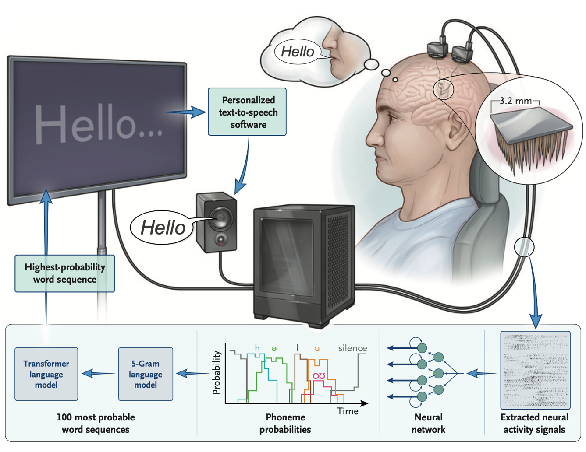

# An Accurate and Rapidly Calibrating Speech Neuroprosthesis
*The New England Journal of Medicine* (2024)

Nicholas S. Card, Maitreyee Wairagkar, Carrina Iacobacci,
Xianda Hou, Tyler Singer-Clark, Francis R. Willett,
Erin M. Kunz, Chaofei Fan, Maryam Vahdati Nia,
Darrel R. Deo, Aparna Srinivasan, Eun Young Choi,
Matthew F. Glasser, Leigh R. Hochberg,
Jaimie M. Henderson, Kiarash Shahlaie,
Sergey D. Stavisky*, and David M. Brandman*.

<span style="font-size:0.8em;">\* denotes co-senior authors</span>



## Overview
This repository contains the code and data necessary to reproduce the results of the paper ["*An Accurate and Rapidly Calibrating Speech Neuroprosthesis*" by Card et al. (2024), *N Eng J Med*](https://www.nejm.org/doi/full/10.1056/NEJMoa2314132).

The code is organized into five main directories: `utils`, `analyses`, `data`, `model_training`, and `language_model`:
- The `utils` directory contains utility functions used throughout the code.
- The `analyses` directory contains the code necessary to reproduce results shown in the main text and supplemental appendix.
- The `data` directory contains the data necessary to reproduce the results in the paper. Download it from Dryad using the link above and place it in this directory.
- The `model_training` directory contains the code necessary to train and evaluate the brain-to-text model. See the README.md in that folder for more detailed instructions.
- The `language_model` directory contains the ngram language model implementation and a pretrained 1gram language model. Pretrained 3gram and 5gram language models can be downloaded [here](https://datadryad.org/dataset/doi:10.5061/dryad.x69p8czpq) (`languageModel.tar.gz` and `languageModel_5gram.tar.gz`). See [`language_model/README.md`](language_model/README.md) for more information.

## Competition
This repository also includes baseline model training and evaluation code for the [Brain-to-Text '25 Competition](https://www.kaggle.com/competitions/brain-to-text-25). The competition is hosted on Kaggle, and the code in this repository is designed to help participants train and evaluate their own models for the competition. The baseline model provided here is a custom PyTorch implementation of the RNN model used in the paper, which can be trained and evaluated using the provided data.

## Data
### Data Overview
The data used in this repository (which can be downloaded from [Dryad](https://datadryad.org/stash/dataset/doi:10.5061/dryad.dncjsxm85), either manually from the website, or using `download_data.py`) consists of various datasets for recreating figures and training/evaluating the brain-to-text model:
- `t15_copyTask.pkl`: This file contains the online Copy Task results required for generating Figure 2.
- `t15_personalUse.pkl`: This file contains the Conversation Mode data required for generating Figure 4.
- `t15_copyTask_neuralData.zip`: This dataset contains the neural data for the Copy Task.
    - There are 10,948 sentences from 45 sessions spanning 20 months. Each trial of data includes: 
        - The session date, block number, and trial number
        - 512 neural features (2 features [-4.5 RMS threshold crossings and spike band power] per electrode, 256 electrodes), binned at 20 ms resolution. The data were recorded from the speech motor cortex via four high-density microelectrode arrays (64 electrodes each). The 512 features are ordered as follows in all data files: 
            - 0-64: ventral 6v threshold crossings
            - 65-128: area 4 threshold crossings
            - 129-192: 55b threshold crossings
            - 193-256: dorsal 6v threshold crossings
            - 257-320: ventral 6v spike band power
            - 321-384: area 4 spike band power
            - 385-448: 55b spike band power
            - 449-512: dorsal 6v spike band power
        - The ground truth sentence label
        - The ground truth phoneme sequence label
    - The data is split into training, validation, and test sets. The test set does not include ground truth sentence or phoneme labels.
    - Data for each session/split is stored in `.hdf5` files. An example of how to load this data using the Python `h5py` library is provided in the [`model_training/evaluate_model_helpers.py`](model_training/evaluate_model_helpers.py) file in the `load_h5py_file()` function.
    - Each block of data contains sentences drawn from a range of corpuses (Switchboard, OpenWebText2, a 50-word corpus, a custom frequent-word corpus, and a corpus of random word sequences). Furthermore, the majority of the data is during attempted vocalized speaking, but some of it is during attempted silent speaking. [`data/t15_copyTaskData_description.csv`](data/t15_copyTaskData_description.csv) contains a block-by-block description of the Copy Task data, including the session date, block number, number of trials, the corpus used, and what split the data is in (train, val, or test). The speaking strategy for each block is intentionally not listed here.
- `t15_pretrained_rnn_baseline.zip`: This dataset contains the pretrained RNN baseline model checkpoint and args. An example of how to load this model and use it for inference is provided in the [`model_training/evaluate_model.py`](model_training/evaluate_model.py) file.

### Data Directory Structure
Please download these datasets from [Dryad](https://datadryad.org/stash/dataset/doi:10.5061/dryad.dncjsxm85) and place them in the `data` directory. Be sure to unzip `t15_copyTask_neuralData.zip` and place the resulting `hdf5_data_final` folder into the `data` directory. Likewise, unzip `t15_pretrained_rnn_baseline.zip` and place the resulting `t15_pretrained_rnn_baseline` folder into the `data` directory. The final directory structure should look like this:
```
data/
├── t15_copyTask.pkl
├── t15_personalUse.pkl
├── hdf5_data_final/
│   ├── t15.2023.08.11/
│   │   ├── data_train.hdf5
│   ├── t15.2023.08.13/
│   │   ├── data_train.hdf5
│   │   ├── data_val.hdf5
│   │   ├── data_test.hdf5
│   ├── ...
├── t15_pretrained_rnn_baseline/
│   ├── checkpoint/
│   │   ├── args.yaml
│   │   ├── best_checkpoint
│   ├── training_log
```

## Dependencies
- The code has only been tested on Ubuntu 22.04 with two NVIDIA RTX 4090 GPUs.
- We recommend using a conda environment to manage the dependencies. To install miniconda, follow the instructions [here](https://docs.anaconda.com/miniconda/miniconda-install/).
- Redis is required for communication between python processes. To install redis on Ubuntu:
    - https://redis.io/docs/getting-started/installation/install-redis-on-linux/
    - In terminal:
        ```bash
        curl -fsSL https://packages.redis.io/gpg | sudo gpg --dearmor -o /usr/share/keyrings/redis-archive-keyring.gpg
        
        echo "deb [signed-by=/usr/share/keyrings/redis-archive-keyring.gpg] https://packages.redis.io/deb $(lsb_release -cs) main" | sudo tee /etc/apt/sources.list.d/redis.list
        
        sudo apt-get update
        sudo apt-get install redis
        ```
    - Turn off autorestarting for the redis server in terminal:
        - `sudo systemctl disable redis-server`
- `CMake >= 3.14` and `gcc >= 10.1` are required for the ngram language model installation. You can install these on linux with `sudo apt-get install cmake` and `sudo apt-get install build-essential`.

## Python environment setup for model training and evaluation
To create a conda environment with the necessary dependencies, run the following command from the root directory of this repository:
```bash
./setup.sh
```

Verify it worked by activating the conda environment with the command `conda activate b2txt25`.

## Python environment setup for ngram language model and OPT rescoring
We use an ngram language model plus rescoring via the [Facebook OPT 6.7b](https://huggingface.co/facebook/opt-6.7b) LLM. A pretrained 1gram language model is included in this repository at [`language_model/pretrained_language_models/openwebtext_1gram_lm_sil`](language_model/pretrained_language_models/openwebtext_1gram_lm_sil). Pretrained 3gram and 5gram language models are available for download [here](https://datadryad.org/dataset/doi:10.5061/dryad.x69p8czpq) (`languageModel.tar.gz` and `languageModel_5gram.tar.gz`). Note that the 3gram model requires ~60GB of RAM, and the 5gram model requires ~300GB of RAM. Furthermore, OPT 6.7b requires a GPU with at least ~12.4 GB of VRAM to load for inference.

Our Kaldi-based ngram implementation requires a different version of torch than our model training pipeline, so running the ngram language models requires an additional seperate python conda environment. To create this conda environment, run the following command from the root directory of this repository. For more detailed instructions, see the README.md in the [`language_model`](language_model) subdirectory.
```bash
./setup_lm.sh
```

Verify it worked by activating the conda environment with the command `conda activate b2txt25_lm`.
